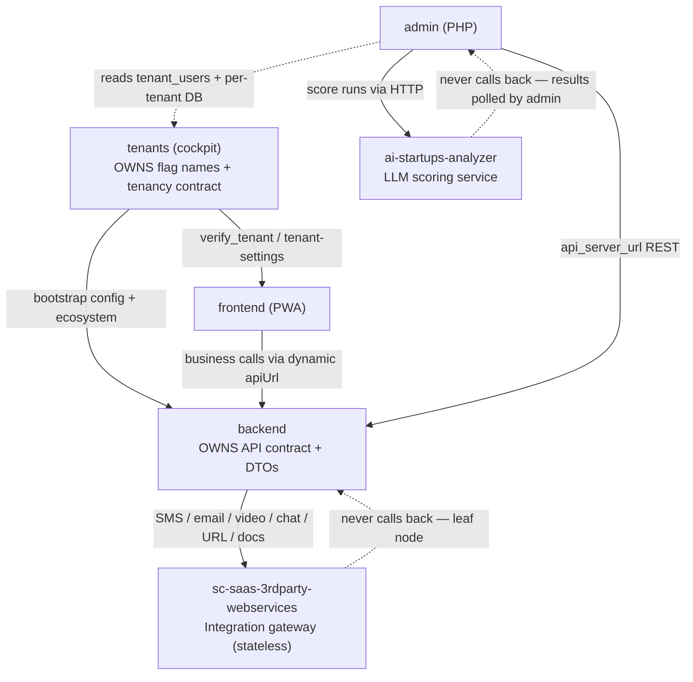

# SanchiSaaS — Workspace Constitution

SanchiSaaS is one product built from **four independently-versioned, independently-deployed Git repos** living side by side (a poly-repo, **not** a monorepo). Each has its own `.git`, dependencies, and deploy pipeline. Together they form a multi-tenant SaaS for startup incubators/accelerators.

| Repo | Role | Stack |
|---|---|---|
| `sanchiconnect-saas-tenants` | **Control plane / cockpit.** Source of truth for feature-flag names + tenant provisioning. Largest blast radius. | NestJS 9, TypeORM, MySQL |
| `sc-saas-backend` | **Business API.** Owns the API contract (controllers + DTOs) every client consumes. | NestJS 8, TypeORM, MySQL |
| `sc-saas-frontend` | **End-user PWA.** Consumes tenants (verify) then backend (business). | Angular 13, NgRx, PWA |
| `sc-saas-admin` | **Admin panel.** Consumes the backend API; reads tenant DB directly. | PHP, Medoo, sparkAdminTpl |
| `ai-startups-analyzer` | **AI scoring service.** LLM-based startup application evaluation; called by sc-saas-admin; supports OpenAI/Anthropic/Gemini via DEFAULT_PROVIDER. | Python 3.10+, FastAPI, SQLAlchemy (async), MySQL |
| `sc-saas-3rdparty-webservices` | **Integration gateway.** Centralises all third-party API calls (SMS, email, video, chat, URL shortening, document conversion). Called only by sc-saas-backend. Stateless — no DB. | NestJS 9, TypeScript |

## Blast-radius graph

Blast radius: **tenants → backend → {frontend, admin}**. A change in `tenants` can reach all three; a change in `backend` can reach frontend + admin. `ai-startups-analyzer` is called only by admin and never pushes results — it is a leaf node with no downstream blast radius. `sc-saas-3rdparty-webservices` is called only by the backend and is also a leaf node — it proxies to external providers and never calls any other SanchiSaaS repo.

## Cross-repo invariants (HARD RULES — never silently break)

1. **Flag names are owned by `tenants`** (`TenantUsersEntity` boolean columns). The flag is the same snake_case string everywhere. Add/rename/remove must propagate to: backend `Feature` enum, frontend `IFeatures`, admin `config.php` constants. Use `/trace-flag` before touching one.
2. **The API contract is owned by `sc-saas-backend`** (controllers + class-validator DTOs, `api/v{n}`). Any controller/DTO change must be checked against frontend `core/service/*` and admin cURL callers. Use `/audit-contract`.
3. **The tenant-verification contract is owned by `tenants`** (`verify_tenant` / `tenant-settings` shape, incl. `apiUrl`). Backend bootstrap and frontend `brand.model.ts` both depend on it.
4. **Auth is JWT** (cookie `accessToken` or Bearer; `single_session_login_enabled` toggles server session tracking). Every consumer attaches the token; auth changes ripple to all clients.
5. **Tenant scoping rule per repo:** `tenants` → every query filters by `domain`; `admin` → selects the per-tenant DB by `admin_domain`; `backend` → one-deployment-per-tenant (config loaded at bootstrap from the tenants API), so **never hardcode or cross-reference another tenant's config/host**. Use `/check-isolation`.

## Where do I look for X?

- **A feature flag's definition** → `sanchiconnect-saas-tenants/src/modules/tenants/entities/tenant-users.entity.ts`
- **A flag's backend gate** → `sc-saas-backend/src/core/constants/enum.ts` (`Feature` enum) + `core/guards/feature-guard.ts`
- **A flag's frontend shape / UI gate** → `sc-saas-frontend/src/app/core/domain/brand.model.ts` (`IFeatures`)
- **A business endpoint / DTO** → `sc-saas-backend/src/modules/<feature>/`
- **The tenant-verification API** → `sanchiconnect-saas-tenants/src/modules/global/global.controller.ts`
- **Tenant DB selection (admin)** → `sc-saas-admin/config/config.php`
- **How the frontend calls the backend** → `sc-saas-frontend/src/app/core/service/api-endpoint.service.ts` + `core/service/*`
- **SMS / OTP sending** → `sc-saas-3rdparty-webservices/src/modules/sms/` (called by `sc-saas-backend/src/core/services/sms.service.ts`)
- **Email delivery (SendGrid or SMTP)** → `sc-saas-3rdparty-webservices/src/modules/sendGrid/` and `ses/` (called by `sc-saas-backend/src/core/services/ses-email.service.ts`)
- **Video meetings (VideoSDK)** → `sc-saas-3rdparty-webservices/src/modules/videoSDK/` (called by `sc-saas-backend/src/core/services/video-sdk.service.ts`)
- **Real-time chat (CometChat)** → `sc-saas-3rdparty-webservices/src/modules/cometChat/` (called by `sc-saas-backend/src/core/services/comet-chat.service.ts`)
- **Short URLs / action links** → `sc-saas-3rdparty-webservices/src/modules/shortIo/` (called by `sc-saas-backend/src/core/services/url.service.ts`)
- **Document conversion (PPT→PNG)** → `sc-saas-3rdparty-webservices/src/modules/convertKit/` (called by `sc-saas-backend/src/core/services/convertapi.service.ts`)
- **Base URL for the gateway** → `sc-saas-backend/src/core/constants/enum.ts` (`SaaSSettingKey.THIRD_PARTY_SERVICE_BASE_URL` in `saasSettings`)

## Specs (structured work orders)

Work is driven by specs, not ad-hoc prompts. Two kinds:
- **Feature specs** — `specs/features/<id>-<slug>.spec.md` (workspace layer; features span repos). Frontmatter routes the work: `repos` (dependency order), `contracts` (api/flags/events), `tenant_scoped`, `depends_on`, `status` (draft→approved→in-progress→in-review→done). A spec with non-empty **Open questions** is NOT approvable.
- **Module specs** — `<repo>/src/<module>/module.spec.md` (committed; only for real bounded contexts). Declare `owns` / `consumes` (api/flags/events) and the `tenant_scoping` mechanism.

Flow: `/from-linear <id>` or `/spec-new feature <id>` → `spec-author` drafts → you approve → `/spec-implement <id>` → `spec-implementer` builds in dependency order, running `/audit-contract`, `/trace-flag`, `/check-isolation` as gates before `in-review`. Templates: `specs/feature.spec.template.md`, `specs/module.spec.template.md`.

## Global guardrails

- **Never commit secrets.** `.env`, key material, credentials stay out of git. (Exception: `sc-saas-backend/cloudfront-*.pem` is intentional and required — leave it.)
- **Any change touching a flag name, the API contract, or the auth model must be checked across every consuming repo** — run the relevant cross-repo command (`/trace-flag`, `/audit-contract`, `/cross-repo-review`) before opening PRs.
- **Every new query/endpoint in a tenant-scoped repo must enforce the scoping rule** (invariant #5).
- **Poly-repo:** each repo is versioned and deployed on its own. Never assume an atomic cross-repo change — coordinate and stage.
- Dev branch = `initial_development`; prod = `main`. Branch before committing. Commit/push only when asked.
