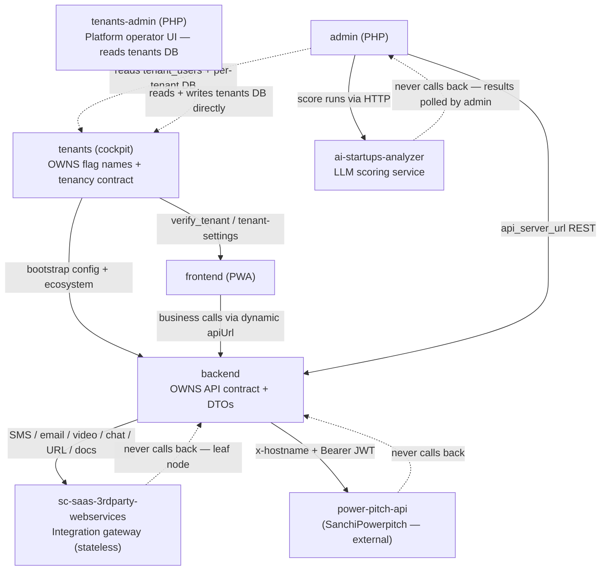

# SanchiSaaS — Workspace Constitution

SanchiSaaS is one product built from **seven independently-versioned, independently-deployed Git repos** living side by side (a poly-repo, **not** a monorepo). Each has its own `.git`, dependencies, and deploy pipeline. Together they form a multi-tenant SaaS for startup incubators/accelerators.

| Repo | Role | Stack |
|---|---|---|
| `sanchiconnect-saas-tenants` | **Control plane / cockpit.** Source of truth for feature-flag names + tenant provisioning. Largest blast radius. | NestJS 9, TypeORM, MySQL |
| `sc-saas-backend` | **Business API.** Owns the API contract (controllers + DTOs) every client consumes. | NestJS 8, TypeORM, MySQL |
| `sc-saas-frontend` | **End-user PWA.** Consumes tenants (verify) then backend (business). | Angular 13, NgRx, PWA |
| `sc-saas-admin` | **Admin panel.** Consumes the backend API; reads tenant DB directly. | PHP, Medoo, sparkAdminTpl |
| `ai-startups-analyzer` | **AI scoring service.** LLM-based startup application evaluation; called by sc-saas-admin; supports OpenAI/Anthropic/Gemini via DEFAULT_PROVIDER. | Python 3.10+, FastAPI, SQLAlchemy (async), MySQL |
| `sc-saas-3rdparty-webservices` | **Integration gateway.** Centralises all third-party API calls (SMS, email, video, chat, URL shortening, document conversion). Called only by sc-saas-backend. Stateless — no DB. | NestJS 9, TypeScript |
| `sanchiconnect-saas-tenants-admin` | **Tenants control-plane admin UI.** PHP admin panel for platform operators to manage the tenants DB directly (tenant provisioning, settings, roles). Leaf node — no downstream calls. | PHP, Medoo, sparkAdminTpl (QUCod) |

## Blast-radius graph

```mermaid
graph TD
    T["tenants (cockpit)<br/>OWNS flag names + tenancy contract"]
    B["backend<br/>OWNS API contract + DTOs"]
    F["frontend (PWA)"]
    A["admin (PHP)"]
    AI["ai-startups-analyzer<br/>LLM scoring service"]
    W["sc-saas-3rdparty-webservices<br/>Integration gateway (stateless)"]
    TA["tenants-admin (PHP)<br/>Platform operator UI — reads tenants DB"]
    T -->|verify_tenant / tenant-settings| F
    T -->|bootstrap config + ecosystem| B
    F -->|business calls via dynamic apiUrl| B
    A -->|api_server_url REST| B
    A -.->|reads tenant_users + per-tenant DB| T
    A -->|score runs via HTTP| AI
    AI -.->|never calls back — results polled by admin| A
    B -->|SMS / email / video / chat / URL / docs| W
    W -.->|never calls back — leaf node| B
    TA -.->|reads + writes tenants DB directly| T
    B -->|x-hostname + Bearer JWT| PP["power-pitch-api<br/>(SanchiPowerpitch — external)"]
    PP -.->|never calls back| B
```

Blast radius: **tenants → backend → {frontend, admin}**. A change in `tenants` can reach all three; a change in `backend` can reach frontend + admin. `ai-startups-analyzer` is called only by admin and never pushes results — it is a leaf node with no downstream blast radius. `sc-saas-3rdparty-webservices` is called only by the backend and is also a leaf node — it proxies to external providers and never calls any other SanchiSaaS repo. `sanchiconnect-saas-tenants-admin` shares the tenants MySQL DB directly with `sanchiconnect-saas-tenants` — a DB schema change in tenants can break both the NestJS app and the PHP admin simultaneously. `power-pitch-sanchiconnect-api` (SanchiPowerpitch workspace, external) is called by the backend via `PowerPitchExternalService` — a change to its `/v1/externals/*` contract breaks the backend's power-pitch module silently.

## Cross-repo invariants (HARD RULES — never silently break)

1. **Flag names are owned by `tenants`** (`TenantUsersEntity` boolean columns). The flag is the same snake_case string everywhere. Add/rename/remove must propagate to: backend `Feature` enum, frontend `IFeatures`, admin `config.php` constants. Use `/trace-flag` before touching one.
2. **The API contract is owned by `sc-saas-backend`** (controllers + class-validator DTOs, `api/v{n}`). Any controller/DTO change must be checked against frontend `core/service/*` and admin cURL callers. Use `/audit-contract`.
3. **The tenant-verification contract is owned by `tenants`** (`verify_tenant` / `tenant-settings` shape, incl. `apiUrl`). Backend bootstrap and frontend `brand.model.ts` both depend on it.
4. **Auth is JWT** (cookie `accessToken` or Bearer; `single_session_login_enabled` toggles server session tracking). Every consumer attaches the token; auth changes ripple to all clients.
5. **Tenant scoping rule per repo:** `tenants` → every query filters by `domain`; `admin` → selects the per-tenant DB by `admin_domain`; `backend` → one-deployment-per-tenant (config loaded at bootstrap from the tenants API), so **never hardcode or cross-reference another tenant's config/host**. Use `/check-isolation`.
6. **Cross-workspace PowerPitch contract** — `sc-saas-backend` calls `power-pitch-sanchiconnect-api`'s `/v1/externals/*` endpoints via `PowerPitchExternalService`. Tenant identity is conveyed by `x-hostname` header; session token obtained via `POST /v1/externals/create-session` is cached and refreshed 10 min before JWT expiry. Any endpoint rename, DTO change, or auth model change in the external module **must** be checked against `sc-saas-backend/src/core/services/power-pitch-external.service.ts`. `power-pitch-sanchiconnect-api` is one of **four** repos in the sibling `SanchiPowerpitch` workspace (cloned separately at `../SanchiPowerpitch`, not under this folder) — the other three (`power-pitch-sanchiconnect-frontend`, `power-pitch-sanchiconnect-admin`, `power-pitch-partners`) have no confirmed contract with any SanchiSaaS repo; this is the only cross-workspace edge.

## Where do I look for X?

- **A feature flag's definition** → `sanchiconnect-saas-tenants/src/modules/tenants/entities/tenant-users.entity.ts`
- **A flag's backend gate** → `sc-saas-backend/src/core/constants/enum.ts` (`Feature` enum) + `core/guards/feature-guard.ts`
- **A flag's frontend shape / UI gate** → `sc-saas-frontend/src/app/core/domain/brand.model.ts` (`IFeatures`)
- **A business endpoint / DTO** → `sc-saas-backend/src/modules/<feature>/`
- **The tenant-verification API** → `sanchiconnect-saas-tenants/src/modules/global/global.controller.ts`
- **Tenant DB selection (admin)** → `sc-saas-admin/config/config.php`
- **How the frontend calls the backend** → `sc-saas-frontend/src/app/core/service/api-endpoint.service.ts` + `core/service/*`
- **SMS / OTP sending** → `sc-saas-3rdparty-webservices/src/modules/sms/` (called by `sc-saas-backend/src/core/services/sms.service.ts`)
- **Email delivery (SendGrid or SMTP)** → `sc-saas-3rdparty-webservices/src/modules/sendGrid/` and `ses/` (called by `sc-saas-backend/src/core/services/ses-email.service.ts`)
- **Video meetings (VideoSDK)** → `sc-saas-3rdparty-webservices/src/modules/videoSDK/` (called by `sc-saas-backend/src/core/services/video-sdk.service.ts`)
- **Real-time chat (CometChat)** → `sc-saas-3rdparty-webservices/src/modules/cometChat/` (called by `sc-saas-backend/src/core/services/comet-chat.service.ts`)
- **Short URLs / action links** → `sc-saas-3rdparty-webservices/src/modules/shortIo/` (called by `sc-saas-backend/src/core/services/url.service.ts`)
- **Document conversion (PPT→PNG)** → `sc-saas-3rdparty-webservices/src/modules/convertKit/` (called by `sc-saas-backend/src/core/services/convertapi.service.ts`)
- **Base URL for the gateway** → `sc-saas-backend/src/core/constants/enum.ts` (`SaaSSettingKey.THIRD_PARTY_SERVICE_BASE_URL` in `saasSettings`)
- **Tenant provisioning / cockpit DB management UI** → `sanchiconnect-saas-tenants-admin/modules/` (PHP admin panel over the tenants DB). Every non-`spa_`-prefixed table's Add/Edit/Table/Detail page in this repo is generated by one generic engine (`add.php`/`edit.php`/`table.php`/`detail.php`, driven by `spa_data_management` field metadata and an optional `spa_form_layouts`/`spa_form_sections` sectioning override) — not per-table controllers. See that repo's own CLAUDE.md for a known landmine (incomplete section config can blank an entire Add form).
- **Tenant provisioning prerequisite** → `tenant_users.organization_id` is NOT NULL with no default (`sanchiconnect-saas-tenants/src/modules/tenants/entities/tenant-users.entity.ts`) — a new tenant cannot be provisioned without a pre-existing `organizations` row (only `name` is required on that table). Relevant to any tenant-onboarding tooling in `sanchiconnect-saas-tenants-admin`.
- **AI credits / billing** → owned by `sanchiconnect-saas-tenants/src/modules/ai-credits/` (wallet, ledger, packages, orders, grants, task-rates; Easebuzz payment-gateway webhooks are currently unauthenticated — verify signatures before trusting a payload). Managed from the operator side via `sanchiconnect-saas-tenants-admin/modules/ai_credits/`.
- **Platform operator roles & permissions** → `sanchiconnect-saas-tenants-admin/config/config.php` (role IDs from ENV) + `modules/auth/admins.php`
- **Tenants-admin global settings (encrypted)** → `sanchiconnect-saas-tenants-admin/modules/developer/settings_management.php` + `spa_settings` table in tenants DB
- **Tenants-admin email / API configuration** → `sanchiconnect-saas-tenants-admin/modules/developer/` (email_management, api_management)
- **How the backend calls PowerPitch (create-session, video, transcript)** → `sc-saas-backend/src/core/services/power-pitch-external.service.ts`
- **PowerPitch external module (the receiving end in SanchiPowerpitch)** → `power-pitch-sanchiconnect-api/src/modules/external/` (SanchiPowerpitch workspace)
- **Zoho CRM sync** → exists **independently** in two repos — `sc-saas-backend/src/core/zoho/` and `sc-saas-admin/includes/zoho_functions.php`. These are NOT the same integration and don't share a contract; don't assume a change in one affects the other.

## Specs (structured work orders)

Work is driven by specs, not ad-hoc prompts. Two kinds:
- **Feature specs** — `specs/features/<id>-<slug>.spec.md` (workspace layer; features span repos). Frontmatter routes the work: `repos` (dependency order), `contracts` (api/flags/events), `tenant_scoped`, `depends_on`, `status` (draft→approved→in-progress→in-review→done). A spec with non-empty **Open questions** is NOT approvable.
- **Module specs** — `<repo>/src/<module>/module.spec.md` (committed; only for real bounded contexts). Declare `owns` / `consumes` (api/flags/events) and the `tenant_scoping` mechanism. Every repo now has full module-spec coverage; find any module's spec fast via that repo's index (`specs/<repo>-module-specs-index.md` — see `knowledge.md` §11 for the full list and how they're organized) rather than grepping cold.

Flow: `/from-linear <id>` or `/spec-new feature <id>` → `spec-author` drafts (and creates a Linear Project + one Todo issue per affected repo) → you approve → `/spec-implement <id>` → `spec-implementer` builds in dependency order, running `/audit-contract`, `/trace-flag`, `/check-isolation` as gates before `in-review`, moving each repo's Linear issue Todo → In Progress → In Review → Done as work actually happens. Every issue created this way carries a severity (Linear's native Priority field), a repo badge label (the `Repo: *` group), and an assignee from a fixed repo→developer mapping — set once at creation and never touched by later state-only updates; `spec-implementer`/`bug-fix` must never edit a repo other than the one an issue is labeled for. Templates: `specs/feature.spec.template.md`, `specs/module.spec.template.md`. For a narrowly-scoped bug fix or small enhancement that doesn't need a spec, use `/bug-fix` instead — flat Linear issue in the team backlog, no project. See `specs/spec-authoring-practices.md` for the underlying practices (check code before proposing new entities, evidence-tag claims, name cross-repo contract impact, Linear tracking, severity/labels/assignee).

### Standing process — every task/issue follows this loop (adopted 2026-07-27, confirmed mandatory 2026-07-30)

Per **"The SanchiConnect Way · Book Two: The Developer Guide"** (by Prabs; `~/Desktop/SanchiConnect-Developer-Guide.pdf`), **every** Linear issue worked in this workspace — feature or bug fix, no exceptions — goes through this 10-step loop, not just the spec-driven feature path:

1. **Orient** on the Linear issue — read it, understand what's actually being asked.
2. **`/from-linear <id>`** — pull the issue into a governing spec.
3. **`/spec-new feature <id>`** (or edit the existing governing spec if one already covers it). For a narrowly-scoped bug fix, this collapses to `/bug-fix` instead — see below.
4. **Resolve open design questions** — any `[DESIGN DECISION PENDING]` is routed to the product owner (business questions) or dev lead (technical questions). Never invent an answer.
5. **Run the matching contract check** — `/trace-flag` (flags), `/audit-contract` (API/DTO), `/check-isolation` (tenant-scoped queries).
6. **Write tests first.** Currently blocked workspace-wide: the guide's referenced "guardian" skill doesn't exist here yet. Until it does, substitute the strongest verification actually available (type-check, lint, existing test suite, manual repro) and say explicitly that automated test coverage wasn't added.
7. **Branch off `ai_native_setup`** — one branch per repo touched, before editing, not after.
8. **`/spec-implement <id>`** — the actual development.
9. **Verify** against tests/acceptance criteria, then update module specs + Gap Register + Linear issue states.
10. **PR into `ai_native_setup` → lead review → merge → close.**

**For a narrowly-scoped bug fix or small enhancement that doesn't need a full feature spec, use `/bug-fix`** (flat Linear issue, no project) as the lightweight variant of this same loop — but steps 1, 5–7, and 9 still apply: orient on the issue, run the relevant contract check, branch per repo before editing, and update Linear state + specs when done. "Lightweight" means skipping the feature-spec document and Gap Register ceremony for genuinely small changes, not skipping branching or verification.

This applies retroactively as the bar going forward: a multi-issue fix pass (e.g. triaging a batch of bug reports) must still branch per repo and update Linear state per issue — it does not get a blanket exemption just because it's several small fixes rather than one large feature.

## Global guardrails

- **Never commit secrets.** `.env`, key material, credentials stay out of git. (Exception: `sc-saas-backend/cloudfront-*.pem` is intentional and required — leave it.)
- **Any change touching a flag name, the API contract, or the auth model must be checked across every consuming repo** — run the relevant cross-repo command (`/trace-flag`, `/audit-contract`, `/cross-repo-review`) before opening PRs.
- **Every new query/endpoint in a tenant-scoped repo must enforce the scoping rule** (invariant #5).
- **Poly-repo:** each repo is versioned and deployed on its own. Never assume an atomic cross-repo change — coordinate and stage.
- **Unauthenticated-endpoint pattern:** a workspace-wide documentation audit (2026-07-16) found several real, unguarded endpoints across repos — `sc-saas-backend`'s Zoho routes (no `@UseGuards`), the `ai-credits` Easebuzz webhooks in `sanchiconnect-saas-tenants` (verify provider signature), and `ai-startups-analyzer`'s `/generate-api-key/` (unauthenticated whenever `ANALYZER_BOOTSTRAP_SECRET` is unset). When adding a new endpoint anywhere in the workspace, explicitly decide and state its auth model — don't let "someone will add a guard later" be the default.
- Dev branch = `initial_development`; prod = `main`. Branch before committing. Commit/push only when asked.
